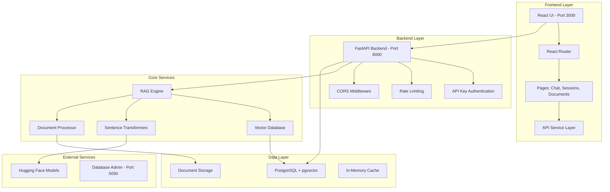
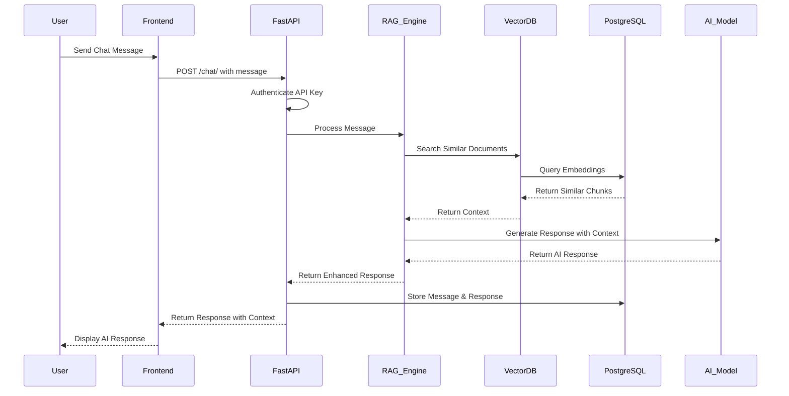

# 🚀 RAG Chat Storage - AI-Powered Conversational System

A production-ready **Retrieval-Augmented Generation (RAG)** chat application built with **FastAPI**, **React**, and **PostgreSQL + pgvector**. This microservice enables intelligent conversations powered by document knowledge retrieval and vector similarity search.

## 📋 Table of Contents

- [🏗️ Architecture Overview](#️-architecture-overview)
- [📁 Project Structure](#-project-structure)
- [✨ Key Features](#-key-features)
- [🛠️ Essential Shell Scripts](#️-essential-shell-scripts)
- [🚀 Quick Start](#-quick-start)
- [📖 Usage Examples](#-usage-examples)
- [🌐 Service URLs](#-service-urls)
- [🔧 API Endpoints](#-api-endpoints)
- [📊 Workflow Diagram](#-workflow-diagram)
- [🏛️ Database Schema](#️-database-schema)
- [🧩 Technology Stack](#-technology-stack)
- [⚡ Performance & Scalability](#-performance--scalability)
- [🔒 Security Features](#-security-features)
- [🚦 Development](#-development)
- [📈 Monitoring & Logging](#-monitoring--logging)
- [🤝 Contributing](#-contributing)

## 🏗️ Architecture Overview



## 📁 Project Structure

```
rag_chat_storage/
├── .env                       # Environment configuration
├── Dockerfile                 # Docker container definition
├── README.md                  # Main project documentation
├── app/                       # FastAPI Backend Application
│   ├── __init__.py            # Package marker
│   ├── api/                   # API endpoint routers
│   │   ├── __init__.py        # Package marker
│   │   ├── documents.py       # Document upload/search endpoints
│   │   ├── health.py          # Health check endpoints
│   │   ├── messages.py        # Message CRUD endpoints
│   │   ├── rag_chat.py        # RAG chat functionality
│   │   └── sessions.py        # Session management endpoints
│   ├── core/                  # Core functionality & configurations
│   │   ├── __init__.py        # Package marker
│   │   ├── database.py        # Database configuration & connection
│   │   ├── exceptions.py      # Custom exception handlers
│   │   ├── limiter.py         # Rate limiting implementation
│   │   ├── logging.py         # Centralized logging configuration
│   │   ├── rag/               # RAG-specific components
│   │   │   ├── __init__.py    # Package marker
│   │   │   ├── chunker.py     # Document chunking logic
│   │   │   ├── embeddings.py  # Vector embeddings generation
│   │   │   └── vectorstore.py # Vector database operations
│   │   └── security.py        # Authentication & API key management
│   ├── main.py                # FastAPI application entry point
│   ├── models/                # SQLAlchemy database models
│   │   ├── __init__.py        # Package marker
│   │   ├── chat.py            # Chat sessions & messages models
│   │   └── documents.py       # Document storage models
│   └── schemas/               # Pydantic request/response schemas
│       ├── __init__.py        # Package marker
│       ├── chat.py            # Chat-related schemas
│       └── documents.py       # Document schemas
├── create_corpus.sh           # Script for corpus creation
├── docker-compose.yml         # Multi-service orchestration
├── frontend/                  # React Frontend Application
│   ├── package-lock.json      # NPM lock file
│   ├── package.json           # NPM dependencies
│   ├── postcss.config.js      # PostCSS configuration
│   ├── src/                   # React source code
│   │   ├── App.js             # Main React application
│   │   ├── context/           # React context
│   │   │   └── AuthContext.js # Authentication context
│   │   ├── hooks/             # Custom React hooks
│   │   │   └── useApi.js      # API hook
│   │   ├── index.js           # Application entry point
│   │   ├── pages/             # Page components
│   │   │   ├── ChatPage.js    # Main chat interface
│   │   │   ├── DocumentsPage.js # Document management
│   │   │   ├── LoginPage.js   # Authentication page
│   │   │   └── SessionsPage.js # Session management
│   │   └── services/          # API service layer
│   │       └── api.js         # API service interactions
│   └── tailwind.config.js     # Tailwind CSS configuration
├── input_docs/                # Document ingestion directory
│   ├── database_technologies.yaml
│   ├── fastapi_python_guide.md
│   ├── machine_learning_fundamentals.txt
│   ├── natural_language_processing.md
│   ├── rag_system_features.json
│   └── vector_embeddings_search.txt
├── monitor.sh                 # Monitoring script
├── requirements.txt           # Python dependencies
├── scripts/                   # Database initialization scripts
│   └── init_pgvector.sql      # PostgreSQL setup script
├── setup_app.sh               # Setup script for the entire application
├── start_app.sh               # Start full stack application
├── start_backend.sh           # Start backend only
├── stop_app.sh                # Stop full stack application
├── stop_backend.sh            # Stop backend only
├── test_api.sh                # Test API endpoints
└── test_search.sh             # Test RAG chat functionality
```

## ✨ Key Features

### 🤖 **RAG-Powered Conversations**
- **Intelligent Document Retrieval**: Vector similarity search using pgvector
- **Context-Aware Responses**: Combines retrieved knowledge with conversational AI
- **Multi-Document Support**: PDF, TXT, and various document formats
- **Semantic Search**: Advanced embedding-based document discovery

### 💬 **Session Management**
- **Persistent Chat Sessions**: Create, update, and manage conversation threads
- **Session Favorites**: Mark important conversations for quick access
- **Message History**: Complete conversation tracking and retrieval
- **Context Continuity**: Maintain conversation flow across sessions

### 🔒 **Enterprise Security**
- **API Key Authentication**: Secure endpoint access control
- **Rate Limiting**: Protection against API abuse
- **CORS Configuration**: Secure cross-origin resource sharing
- **Input Validation**: Comprehensive request sanitization

### 📊 **Performance & Monitoring**
- **Health Checks**: System status and database connectivity monitoring
- **Request Logging**: Comprehensive API request/response tracking
- **Performance Metrics**: Response time monitoring and optimization
- **Auto-Document Ingestion**: Automatic processing of uploaded documents

### 🎨 **Modern UI/UX**
- **Responsive Design**: Mobile-first, cross-device compatibility
- **Real-time Chat Interface**: Smooth conversational experience
- **Document Upload**: Drag-and-drop document management
- **Session Navigation**: Intuitive conversation management

## 🛠️ Essential Shell Scripts

### 🔧 **0. setup_app.sh** - Complete Application Setup
- **Purpose**: One-click setup for the entire RAG Chat Storage application
- **Features**:
  - System requirements validation (Python, Node.js, Docker)
  - Python virtual environment creation and activation
  - Automatic installation of all backend dependencies
  - Frontend dependencies installation and configuration
  - Environment file creation with sensible defaults
  - Project directory structure setup
  - Script permissions configuration
  - Basic validation and testing
  - Comprehensive setup summary and next steps
- **Usage**: `./setup_app.sh`
- **Interactive**: Prompts for user confirmation and customization options

### 🚀 **1. start_app.sh** - Full Stack Application
- **Purpose**: Starts both backend Docker services and React frontend
- **Features**:
  - Health checks and service monitoring
  - Automatic port cleanup and conflict resolution
  - Comprehensive startup validation
  - Real-time service status reporting
- **Usage**: `./start_app.sh`

### 🛑 **2. stop_app.sh** - Stop Full Stack Application  
- **Purpose**: Gracefully stops all application services
- **Features**:
  - Docker container termination
  - Process cleanup on ports 3000 and 8000
  - Log file cleanup
  - Complete resource deallocation
- **Usage**: `./stop_app.sh`

### 🔧 **3. start_backend.sh** - Backend Only
- **Purpose**: Starts Docker backend services for development/testing
- **Features**:
  - Database and API service initialization
  - Health monitoring and validation
  - Perfect for running test scripts
  - Isolated backend testing environment
- **Usage**: `./start_backend.sh`

### 🔴 **4. stop_backend.sh** - Stop Backend Only
- **Purpose**: Stops backend Docker services
- **Features**:
  - Container-specific shutdown
  - Port 8000 process cleanup
  - Backend resource cleanup
- **Usage**: `./stop_backend.sh`

### 🧪 **5. test_api.sh** - API Testing Suite
- **Purpose**: Comprehensive API endpoint validation
- **Features**:
  - Authentication testing (valid/invalid API keys)
  - Session management CRUD operations
  - Message handling validation
  - Document search functionality testing
  - Health check verification
  - API documentation accessibility
- **Usage**: `./test_api.sh`

### 🔍 **6. test_search.sh** - RAG Chat Testing
- **Purpose**: RAG functionality and chat system validation
- **Features**:
  - Semantic search testing
  - Context retrieval validation
  - Multi-query conversation testing
  - Knowledge-based response verification
  - Session continuity testing
- **Usage**: `./test_search.sh`

## 🚀 Quick Start

### Prerequisites
- **Docker & Docker Compose**: Container orchestration
- **Node.js 18+**: Frontend development
- **Python 3.9+**: Backend development (for local development)

### 1. **Clone Repository**
```bash
git clone <repository-url>
cd rag_chat_storage
```

### 2. **🔧 One-Click Setup (Recommended)**

Use our comprehensive setup script that handles everything automatically:

```bash
# Run the complete setup script
./setup_app.sh

# This script will:
# ✅ Check system requirements (Python, Node.js, Docker)
# ✅ Create Python virtual environment
# ✅ Install all backend dependencies
# ✅ Install all frontend dependencies  
# ✅ Create .env configuration file
# ✅ Set up project directories
# ✅ Make all scripts executable
# ✅ Run basic validation tests
```

**What the setup script does:**
- **System Check**: Validates Python 3.9+, Node.js 18+, npm, and Docker installation
- **Virtual Environment**: Creates and configures Python virtual environment
- **Dependencies**: Installs all Python packages from requirements.txt
- **Frontend Setup**: Installs all npm packages and dependencies
- **Configuration**: Creates .env file with sensible defaults
- **Project Structure**: Creates necessary directories (logs/, input_docs/, tests/)
- **Scripts**: Makes all shell scripts executable
- **Validation**: Runs import tests and build verification

### 3. **Manual Setup (Alternative)**

If you prefer manual setup or need custom configuration:

```bash
# Create virtual environment
python3 -m venv venv
source venv/bin/activate

# Install backend dependencies
pip install -r requirements.txt

# Install frontend dependencies
cd frontend
npm install
cd ..

# Create environment file
cp .env.example .env  # Edit as needed
vim .env

# Make scripts executable
chmod +x *.sh
```

### 4. **Start Full Application**
```bash
# Start all services (backend + frontend)
./start_app.sh

# The application will be available at:
# - Frontend: http://localhost:3000
# - Backend API: http://localhost:8000
# - API Docs: http://localhost:8000/docs
# - Database Admin: http://localhost:5050
```

### 4. **Test the System**
```bash
# Test API endpoints
./test_api.sh

# Test RAG chat functionality
./test_search.sh
```

## 📖 Usage Examples

### **Basic Chat Interaction**
```bash
# Create a new chat session
curl -X POST http://localhost:8000/sessions/ \\
  -H "X-API-KEY: z9pD3bE7qR#sW8vY!mK2uN4x" \\
  -H "Content-Type: application/json" \\
  -d '{"title": "My Chat Session"}'

# Send a message to RAG chat
curl -X POST http://localhost:8000/chat/ \\
  -H "X-API-KEY: z9pD3bE7qR#sW8vY!mK2uN4x" \\
  -H "Content-Type: application/json" \\
  -d '{"session_id": "session-uuid", "message": "What is machine learning?"}'
```

### **Document Search**
```bash
# Search documents by semantic similarity
curl -X POST http://localhost:8000/documents/search \\
  -H "X-API-KEY: z9pD3bE7qR#sW8vY!mK2uN4x" \\
  -H "Content-Type: application/json" \\
  -d '{"query": "artificial intelligence", "top_k": 5, "threshold": 0.7}'
```

### **Health Monitoring**
```bash
# Check system health
curl http://localhost:8000/health/

# Response:
{
  "status": "healthy",
  "timestamp": "2024-07-30T01:00:00Z",
  "database": "connected",
  "vector_store": "operational"
}
```

## 🌐 Service URLs

| Service | URL | Purpose |
|---------|-----|---------|
| 🎨 **Frontend UI** | http://localhost:3000 | React-based user interface |
| 🔗 **Backend API** | http://localhost:8000 | FastAPI REST endpoints |
| 📚 **API Documentation** | http://localhost:8000/docs | Interactive Swagger UI |
| 🗄️ **Database Admin** | http://localhost:5050 | pgAdmin database management |
| 🏥 **Health Check** | http://localhost:8000/health/ | System status monitoring |

### **Default Credentials**
- **API Key**: `z9pD3bE7qR#sW8vY!mK2uN4x`
- **Database Admin**: `admin@ragchat.com` / `admin123`

## 🔧 API Endpoints

### **Authentication**
All API endpoints (except `/health/`) require the `X-API-KEY` header.

### **Core Endpoints**

#### **Sessions Management**
```bash
GET    /sessions/              # List all sessions
POST   /sessions/              # Create new session
GET    /sessions/{id}          # Get session details  
PATCH  /sessions/{id}          # Update session
DELETE /sessions/{id}          # Delete session
```

#### **Messages Management**
```bash
GET    /sessions/{id}/messages  # Get session messages
POST   /sessions/{id}/messages  # Add message to session
PATCH  /messages/{id}           # Update message
DELETE /messages/{id}           # Delete message
```

#### **RAG Chat**
```bash
POST   /chat/                  # Send message and get AI response
```

#### **Document Management**
```bash
POST   /documents/upload       # Upload document for indexing
POST   /documents/search       # Search documents by similarity
GET    /documents/             # List indexed documents
DELETE /documents/{id}         # Remove document from index
```

#### **System Health**
```bash
GET    /health/                # Basic health check
GET    /health/detailed        # Detailed system metrics
```

## 📊 Workflow Diagram



## 🏛️ Database Schema

### **Core Tables**

#### **chat_sessions**
```sql
CREATE TABLE chat_sessions (
    id UUID PRIMARY KEY DEFAULT gen_random_uuid(),
    title VARCHAR(255) NOT NULL,
    is_favorite BOOLEAN DEFAULT FALSE,
    created_at TIMESTAMP DEFAULT CURRENT_TIMESTAMP,
    updated_at TIMESTAMP DEFAULT CURRENT_TIMESTAMP
);
```

#### **messages**
```sql
CREATE TABLE messages (
    id UUID PRIMARY KEY DEFAULT gen_random_uuid(),
    session_id UUID REFERENCES chat_sessions(id) ON DELETE CASCADE,
    sender VARCHAR(20) NOT NULL CHECK (sender IN ('user', 'assistant')),
    content TEXT NOT NULL,
    retrieved_context TEXT,
    created_at TIMESTAMP DEFAULT CURRENT_TIMESTAMP
);
```

#### **documents**
```sql
CREATE TABLE documents (
    id UUID PRIMARY KEY DEFAULT gen_random_uuid(),
    filename VARCHAR(255) NOT NULL,
    original_content TEXT,
    processed_at TIMESTAMP DEFAULT CURRENT_TIMESTAMP,
    file_size INTEGER,
    file_type VARCHAR(50)
);
```

#### **document_chunks** (with pgvector)
```sql
CREATE TABLE document_chunks (
    id UUID PRIMARY KEY DEFAULT gen_random_uuid(),
    document_id UUID REFERENCES documents(id) ON DELETE CASCADE,
    chunk_text TEXT NOT NULL,
    embedding VECTOR(384),  -- Sentence transformer embedding size
    chunk_index INTEGER,
    created_at TIMESTAMP DEFAULT CURRENT_TIMESTAMP
);

-- Vector similarity index
CREATE INDEX ON document_chunks USING ivfflat (embedding vector_cosine_ops);
```

## 🧩 Technology Stack

### **Backend Technologies**
- **🚀 FastAPI**: Modern, fast web framework for building APIs
- **🐍 Python 3.9+**: Core programming language
- **🗄️ PostgreSQL**: Primary relational database
- **🔍 pgvector**: Vector similarity search extension
- **⚡ SQLAlchemy**: Database ORM and migrations
- **🔒 Pydantic**: Data validation and serialization

### **RAG & AI Components**
- **🤖 Sentence Transformers**: Text embedding generation
- **🧠 Hugging Face Transformers**: Pre-trained language models
- **📄 LangChain**: Document processing and chunking
- **🔗 Vector Similarity Search**: Semantic document retrieval

### **Frontend Technologies**
- **⚛️ React 18**: Modern UI library
- **🎨 Tailwind CSS**: Utility-first CSS framework
- **🚦 React Router**: Client-side routing
- **📡 Axios**: HTTP client for API communication
- **🎯 Lucide React**: Modern icon library

### **DevOps & Infrastructure**
- **🐳 Docker & Docker Compose**: Containerization
- **🔧 Uvicorn**: ASGI web server
- **📊 pgAdmin**: Database administration
- **📝 Python Logging**: Comprehensive logging system
- **⏱️ Rate Limiting**: API protection

## ⚡ Performance & Scalability

### **Optimization Features**
- **Vector Indexing**: IVFFlat index for fast similarity search
- **Connection Pooling**: Efficient database connection management
- **Rate Limiting**: API abuse prevention
- **Async Processing**: Non-blocking request handling
- **Caching Strategy**: In-memory caching for frequent queries

### **Scalability Considerations**
- **Microservice Architecture**: Independent service scaling
- **Docker Orchestration**: Container-based deployment
- **Database Optimization**: Proper indexing and query optimization
- **Stateless Design**: Horizontal scaling capability

## 🔒 Security Features

### **Authentication & Authorization**
- **API Key Authentication**: Secure endpoint access
- **Input Validation**: Comprehensive request sanitization
- **CORS Configuration**: Controlled cross-origin access
- **SQL Injection Prevention**: Parameterized queries

### **Data Protection**
- **Environment Variables**: Sensitive data isolation
- **Container Security**: Isolated application environments
- **Database Security**: Connection encryption and access control

## 🚦 Development

### **Backend Development**
```bash
# Start backend only for development
./start_backend.sh

# Install Python dependencies
pip install -r requirements.txt

# Run backend locally (alternative to Docker)
uvicorn app.main:app --reload --host 0.0.0.0 --port 8000
```

### **Frontend Development**
```bash
# Navigate to frontend directory
cd frontend

# Install dependencies
npm install

# Start development server
npm start
```

### **Testing**
```bash
# Run API tests
./test_api.sh

# Run RAG functionality tests
./test_search.sh

# Run Python unit tests
pytest tests/
```

## 📈 Monitoring & Logging

### **Health Checks**
- **Database Connectivity**: PostgreSQL connection status
- **Vector Store**: pgvector functionality verification
- **API Responsiveness**: Endpoint availability monitoring

### **Logging System**
- **Structured Logging**: JSON-formatted log entries
- **Request Tracking**: Complete API request/response logging
- **Error Monitoring**: Exception tracking and alerting
- **Performance Metrics**: Response time and throughput monitoring

### **Log Locations**
- **Application Logs**: `logs/` directory
- **Frontend Logs**: Browser console and `frontend.log`
- **Backend Logs**: Docker container logs and `backend.log`

## 🤝 Contributing

### **Development Workflow**
1. Fork the repository
2. Create a feature branch: `git checkout -b feature/new-feature`
3. Make changes and test thoroughly
4. Run all test scripts: `./test_api.sh && ./test_search.sh`
5. Commit changes: `git commit -m "Add new feature"`
6. Push to branch: `git push origin feature/new-feature`
7. Create Pull Request

### **Code Standards**
- **Python**: Follow PEP 8, use Black formatter
- **JavaScript**: Follow ESLint configuration
- **Documentation**: Update README for new features
- **Testing**: Add test cases for new functionality

### **Issue Reporting**
Please use GitHub Issues for:
- 🐛 Bug reports
- 💡 Feature requests  
- 📚 Documentation improvements
- 🚀 Performance enhancements

---

## 🎯 **Quick Commands Reference**

```bash
# Setup & Essential Operations
./setup_app.sh          # Complete project setup (run first)
./start_app.sh          # Start full stack
./stop_app.sh           # Stop all services  
./start_backend.sh      # Backend only
./test_api.sh           # Test API endpoints
./test_search.sh        # Test RAG chat

# View logs
docker-compose logs -f app        # Backend logs
tail -f frontend.log              # Frontend logs

# Database access
docker exec -it rag_chat_db psql -U raguser -d rag_chat_db
```

**🚀 Ready to start building intelligent conversations with RAG Chat Storage!**
